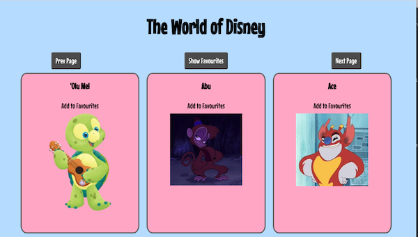

# The World of Disney React App

## Introduction

Throughout this guided lab you'll be working with React Hooks 🪝

The lab will guide you through updating an existing React application to introduce API calls and [React Hooks](https://reactjs.org/docs/hooks-intro.html)

## The application

The application is called **The World of Disney** and users can browse through an entire list of Disney characters!!



As a sense of direction these are the steps you'll cover

* Replace hard coded state of disney characters with an API call
* Utilise `useEffect` to make the API call when the state changes
* Further utilise useEffect to fetch new data from the API when page navigation changes
* Introduce an ability to 'favourite' different characters
* Utilise `useContext` to access the list of favourites from anywhere
* Implement the `showFavourites` functionality to only show your favourite disney characters

## Running the application

Why not start the application before we begin to change it 

To start the application run:

```
npm install
```

Followed by:

```
npm start
```

You should then be able to access the application by opening the browser and visiting

[http://localhost:3000](http://localhost:3000)

## Let's get started

Assuming you were able to start the application, let's move on to the [first activity](./docs/activity_1.md) and bring in the API call.
# learner-materials-api-calls-and-hooks-in-react
