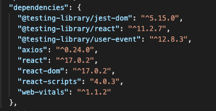
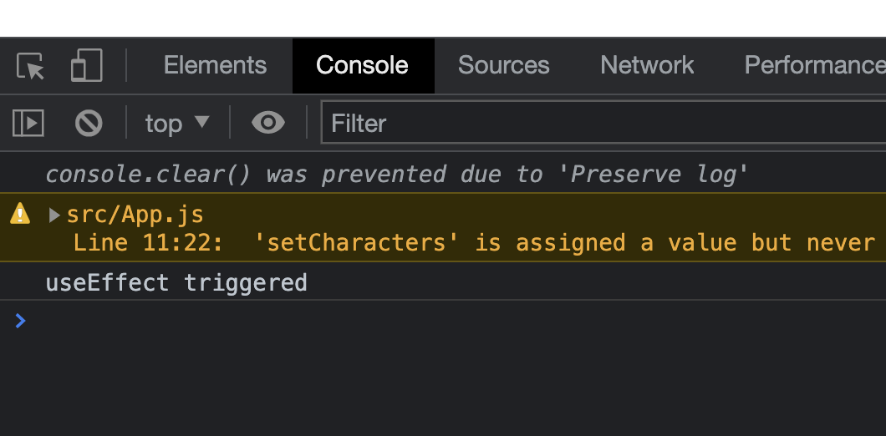

# Activity 1 - Introducing the Disney API

## Introduction

In the [App.js](../src/App.js) on lines 11 to 27 the code declares an array of characters and puts them in to state.

In fact that is where you encounter your first React Hook [useState](https://reactjs.org/docs/hooks-state.html).

We'll utilise the `useState` hook to manage the state of the characters, which is currently [hard-coded](https://en.wikipedia.org/wiki/Hard_coding). In this context, if Disney was to create a new film then your application wouldn't yet reflect the new character until you updated the hard coded characters. Also if you later updated the hard code characters then it would mean you would have to re-deploy the application in order to see them on your application. 😱

In this first activity we're going to replace this hard-coding by utilising an API in order to get the list of Disney characters 🙌

## The Disney API

The API we shall utilise is a community provided Disney API.

[https://disneyapi.dev/](https://disneyapi.dev/)

Have a browse of the website and maybe even try the endpoints

🙋🏽‍♀️ What endpoint do you think we can use for getting all the characters?

<details>
<summary>Click here to see the answer</summary>
<pre>
https://api.disneyapi.dev/characters
</pre>
</details>


As well as the endpoint, we also need to know which [Request Method](https://developer.mozilla.org/en-US/docs/Web/HTTP/Methods) (or sometimes called HTTP Verb) to utilise for making our request to the API.

🙋🏻 Which request method should you utilise

<details>
<summary>Click here to see the answer</summary>
<pre>
GET
</pre>
</details>

## Installing axios

So we know that we need to send a **GET** request to the **https://api.disneyapi.dev/characters** API endpoint. Let's set about doing that now 🙌

Firstly we need to write some code to execute the **GET** request. 

Within JavaScript there are lots of [different ways of making an API call](https://levelup.gitconnected.com/all-possible-ways-of-making-an-api-call-in-plain-javascript-c0dee3c11b8b). Some popular ones are:

* [Axios](https://www.npmjs.com/package/axios)
* [Fetch API](https://developer.mozilla.org/en-US/docs/Web/API/Fetch_API)

For this lab we'll make use of **Axios** for making our API calls. 

We first need to install axios as a dependency. 

👉 Open up your terminal and navigate to the root of this project (where the **package.json** is located)

👉 Run the following command to install Axios as a dependency

```
npm install axios --save
```

Once the installation is complete you should now see **axios** listed in the dependencies within your [package.json](../package.json).

Like the image below



👉 At this stage its worth committing and pushing your code up to your GitHub repository. Don't forget to add a descriptive commit message!

## Utilising axios and useEffect to call the API

Axios allows us to write API calls in a fairly succinct way.

For example if we wanted to send a **GET** request to the studio Ghibli API to get all the people we could write something like this:

```
axios.get('https://ghibliapi.herokuapp.com/people')
.then(function (response) {
    // handle success
    console.log(response.data);
})
.catch(function (error) {
    // handle error
    console.log(error);
});
```

Notice the use of promise handling or alternatively if we wanted to use the [async/await](https://developer.mozilla.org/en-US/docs/Learn/JavaScript/Asynchronous/Async_await). Here is an example of the same code with the async/await approach.

```
const getPeople = async () => {
    const response = await axios.get('https://ghibliapi.herokuapp.com/people')
    return response.data;
}
```

We'll make use of this approach for calling the Disney API.

The other piece of information we need to decide is when to invoke calling the API.

This is where the next React hook can help us. We'll make use of [useEffect](https://reactjs.org/docs/hooks-effect.html)

With the **useEffect** hook we make use of the concept of ["side effects"](https://dmitripavlutin.com/react-useeffect-explanation/). In this case, when the component loads we want a side effect of fetching the disney character data from the API.

👉 Firstly let's change the default state of characters to be an empty array

```
const [characters, setCharacters] = useState([]);
```

Now we can introduce the **useEffect** hook. 

👉 Firstly we need to import the hook, update line 3 of the App.js to import the **useEffect** hook from React.

```
import React, { useState, useEffect } from 'react';
```

👉 After the various pieces of state have been declared (but before the component returns) introduce the useEffect hook

```
useEffect(() => {
    console.log("useEffect triggered");
}, []);
```

👉 In the lines above you introduce the useEffect hook and it simply prints a line to the console.

👉 Try stopping your application and restarting it with the browser console open. Did you see it print out "useEffect triggered"

You should see something similar to the screenshot below



Great stuff! We're successfully "hooking" into the component loading.

🤔 But why does this hook only trigger on the components first load?

<details>
<summary>Click here to see the answer</summary>
<pre>
💡 We're passing in an empty array of dependencies to `useEffect` - basically saying to React "run this function every time this empty array changes", which only happens the first time, when it 'changes' from "nothing" to "the empty array", which then never changes again.
</pre>
</details>

Now let's update the contents of that hook to fetch the characters from the API instead of console logging. In order to do that we need to import and utilise the **axios** framework in your **App.js**

👉 Add the import for axios at the top of your **App.js**

```
import axios from 'axios';
```

👉 Now let's introduce a function for getting characters and then we'll update your useEffect method. We'll make use of the **axios get** function and **async/await**. Underneath where your various state is declared create a `getCharacters` function

```
const getCharacters = async (pageNumber) => {
  // Utilised Axios for API calls
  const apiResponse = await axios.get(`http://api.disneyapi.dev/characters?page=${pageNumber}`);
  setCharacters(apiResponse.data.data);
};
```

Notice how this method is marked **async** meaning we can utilise the **await** keyword within it. We firstly call the API using **axios** providing a **pageNumber** which is passed in as an argument. We then use the **setCharacters** function that is provided by **useState** to set the list of characters.

With Axios all HTTP requests will return **response**. Here we assign that **response** to the variable called **apiResponse**.

The **response** has a number of properties one of which is **data** which is essentially the response body. 

If you go back to check the Disney API, notice that the response of the API call is a JSON object that has a property called **data**. That is why we utilise the **apiResponse.data.data** path for getting the actual array of characters.

👉 Finally let's call that **getCharacters** function from within your **useEffect** hook. Update the **useEffect** method to look like the following

```
useEffect(() => {
  getCharacters(1);
}, []);
```

👉 Stop and start you application (you probably actually don't need to stop and start but it might be worth it just in case there are any errors). You should see a lovely list of Disney characters....but wait their images don't seem to be appearing?!?!

🎉 You choose to ignore that for now and bask in the glory of introducing your first API. Moving on to [activity 2](./activity_2.md) to go ahead and fix those damn images.

👉 Before moving on to activity 2 make sure to compile your own notes around what you have covered and by all means ask us any questions.

🙋🏻 At this point your App.js should look pretty similar to this

```
import './App.css';
import axios from 'axios';
import React, { useState, useEffect } from 'react';
import Header from './components/Header';
import CharacterContainer from './components/CharacterContainer';
import Navigation from './components/Navigation';

function App() {

  const [characters, setCharacters] = useState([]);
  const [currentPage, setCurrentPage] = useState(1);

  const getCharacters = async (pageNumber) => {
    // Utilised Axios for API calls
    const apiResponse = await axios.get(`http://api.disneyapi.dev/characters?page=${pageNumber}`);
    setCharacters(apiResponse.data.data);
  };

  useEffect(() => {
    getCharacters(1);
  }, []);

  return (
    <div className="page">
      <Header currentPage={currentPage} />
      <Navigation currentPage={currentPage} setCurrentPage={setCurrentPage} />
      <CharacterContainer characters={characters} />
    </div>
  );
}

export default App;
```


Let's move on to the [second activity](./activity_2.md)