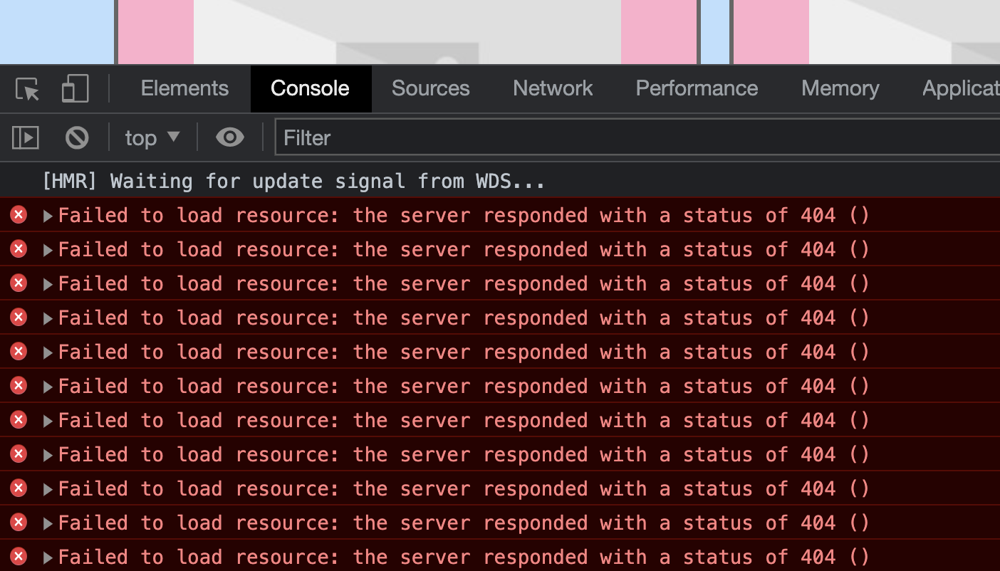

# Activity 2 - Working with API's

## Diagnosing the image issue

One of the challenges of working with API's is that we are often not in control of the data structure or even the contents of what the API responds with. That could be because the API is provided by a separate business or organisation (like in our case with the Disney API) or maybe the API is provided by another team within the same business.

As a result we can often find issues when testing or running applications that talk to APIs.

Often a decision must be made around where the issue should be fixed - should it be in the frontend code or should the API providers fix the issue? For the API provider, if they fix the issue for you and your requirements then they run the risk of breaking it for other teams or developers.

Let's look deeper into why the images aren't loading. 

If you look in the browser console you'll notice that there are lot of 404 status code errors. File not found. Similar to the image below:



If we cross reference that with the component that displays characters [Character.js](../src/components/Character.js) notice that it seems to be using **character.imageUrl** for the **src** of the image.

👉 Try hitting the characters endpoint with your browser and copy the path to the **imageUrl** of one of the results. It should look something like this: `https://static.wikia.nocookie.net/disney/images/6/61/Olu_main.png/revision/latest?cb=20200630025227`

Did the image load? Sometimes it does and sometimes it doesn't. That URL looks odd because it seems to reference a PNG image but then there are further path information after the **png** part such as `/revision/latest?cb=20200630025227`. This almost seems like another API for fetching images. 

🤔 You take a sip of your drink and have a ponder. "I wonder if I can strip off everything after the image path and see if that loads". Essentially remove the `/revision/latest?cb=20200630025227` part of the URL. Whilst also maybe thinking about failure scenarios - what would happen if the character didn't have an image? It would be nice to have a default image shown.

👉 Update your [Character.js](../src/components/Character.js) to handle these scenarios

```
function Character({ character }) {

  // Define a default in case the character doesn't have an image
  let imageSrc = "https://picsum.photos/300/200/?blur";
  if (character.imageUrl) {
    // API seems to include extra path for images so here we strip it off to fetch raw image
    imageSrc = character.imageUrl.substring(0, character.imageUrl.indexOf('/revision'));
  }

  return (
    <article className="character-item">

      <h2>{character.name}</h2>

      <div className="character-item__actions">
        Add to Favourites
      </div>

      

    </article>
  )
}

export default Character
```

👉 Have a look at your application in the browser now. Can you see the images? 

Here we worked through some of the challenges you might experience when consuming an API. Not specifically around images but facing scenarios where you have a certain portion of data or data might not be in the form you'd like it to be then often you'll need to talk with the API provider (whether thats another team member, another team entirely or even another external organisation) in order to find the best fix for the bug.

👉 It's well worth committing and pushing to your repository before moving on to [activity 3](./activity_3.md) where we'll implement the ability to paginate through the characters.

